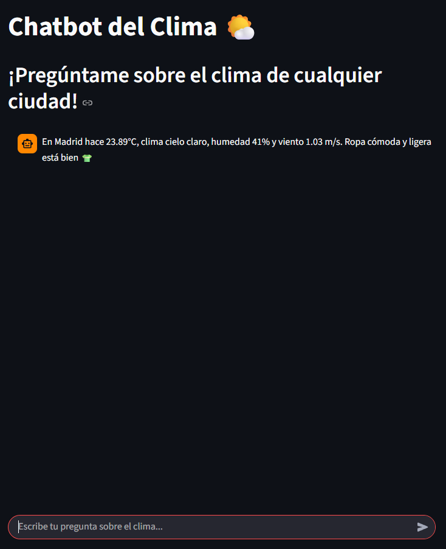

# ES
## Chatbot de clima 🌤️

Se realiza una aplicación interactiva desarrollada con Streamlit. Su base es el uso de la **API de OpenWeather**, la cual proporciona información del clima de las ciudades en tiempo real.

## Característocas principales

Permite conocer el clima actual de prácticamente cualquier ciudad del mundo, en cuestión de segundos.
Interacción natural: el chatbot entiende consultas escritas en español y responde de forma clara, cercana y amigable.
Asesor de vestimenta: según la temperatura y el tipo de clima 
Interfaz moderna: la aplicación cuenta con una interfaz limpia e intuitiva construida completamente con Streamlit, sin necesidad de un backend complejo.

## Proximas actualizaciones

Integrar reconocimiento de lenguaje natural (NLP) para detectar ciudades automáticamente dentro de frases complejas.
Mostrar pronósticos extendidos de varios días.
Incorporar un sistema de almacenamiento de consultas para estadísticas o seguimiento.
Añadir soporte multilingüe (español / inglés).

## Imagenes

# EN

## Weather Chatbot 🌤️

An interactive application developed with Streamlit. Its core functionality is based on the OpenWeather API, which provides real-time weather information for cities around the world.

## Main Features

Allows users to check the current weather in virtually any city in the world within seconds.

Natural interaction: the chatbot understands questions written in Spanish and responds clearly and naturally.

Clothing advisor: suggests appropriate clothing based on temperature and weather conditions.

Modern interface: features a clean and intuitive design built entirely with Streamlit, without the need for a complex backend.

## Upcoming Updates

Integrate Natural Language Processing (NLP) to automatically detect city names within complex phrases.

Display extended multi-day weather forecasts.

Implement a query storage system for statistics and tracking.

Add multilingual support (Spanish / English).

## Images

